# 骆言项目Issue #2185战略路线图任务分解报告

**Author: Bravo, Issue Decomposer**  
**报告日期**: 2025年8月5日  
**父级Issue**: #2185 Papa综合分析战略路线图  
**分解策略**: 功能模块化、优先级驱动、单一职责原则

---

## 📋 执行摘要

基于Papa在Issue #2185中提出的综合战略路线图，本报告将6,452字符的战略规划分解为8个具体的、可执行的开发任务。每个任务都具有明确的技术边界、验收标准和实施指导，可在单个Pull Request中完成。

### 核心分解原则

1. **单一职责**: 每个子Issue专注一个功能模块
2. **可并行性**: 最大化团队并行开发能力  
3. **优先级驱动**: P0任务优先，确保关键路径
4. **渐进式交付**: 每个任务都有独立价值
5. **中文友好**: 保持骆言诗意编程文化特色

---

## 🎯 任务分解全景图

### Phase A: 标准库核心功能完善 (2025年8月-9月)
**目标**: 将标准库从「演示级」提升为「生产可用级」

| Issue编号 | 任务名称 | 优先级 | 工作量 | 状态 |
|-----------|----------|--------|--------|------|
| #2189 | 数学模块三角函数和高级数学运算 | P0 | 3-5天 | Ready |
| #2190 | 列表操作尾递归优化和性能提升 | P0 | 4-7天 | Ready |
| #2191 | 字符串模块Unicode中文处理现代化 | P1 | 5-8天 | Ready |

### Phase B: 实用工具库建设 (2025年10月-11月)
**目标**: 建设让骆言真正实用的工具生态

| Issue编号 | 任务名称 | 优先级 | 工作量 | 状态 |
|-----------|----------|--------|--------|------|
| #2192 | 创建文件系统模块基础API | P0 | 7-10天 | Ready |
| #2193 | 网络通信模块和HTTP客户端实现 | P1 | 8-12天 | Ready |
| #2194 | 并发编程模块和异步支持实现 | P1 | 10-14天 | Ready |

### Phase C: 开发者生态建设 (2025年11月-12月)
**目标**: 完善开发体验，推动社区采用

| Issue编号 | 任务名称 | 优先级 | 工作量 | 状态 |
|-----------|----------|--------|--------|------|
| #2195 | 骆言包管理系统设计和实现 | P0 | 14-21天 | Ready |
| #2196 | 开发工具完善：LSP服务器和VSCode扩展 | P1 | 12-18天 | Ready |

---

## 🔗 依赖关系分析

### 关键路径识别

```mermaid
graph TD
    A[#2189 数学模块] --> D[#2192 文件系统模块]
    B[#2190 列表模块] --> E[#2193 网络通信模块]
    C[#2191 字符串模块] --> D
    C --> E
    D --> F[#2194 并发编程模块]
    E --> F
    D --> G[#2195 包管理系统]
    E --> G
    F --> H[#2196 开发工具链]
    G --> H
```

### 并行开发窗口

#### 第一波并行 (立即可开始)
- **#2189 数学模块** - 独立模块，可立即开始
- **#2190 列表模块** - 独立模块，可立即开始

#### 第二波并行 (A1/A2完成后)
- **#2191 字符串模块** - 需要列表模块的某些功能
- **#2192 文件系统模块** - 需要字符串Unicode支持

#### 第三波并行 (B1完成后)
- **#2193 网络通信模块** - 需要文件系统和字符串支持
- **#2194 并发编程模块** - 需要多个基础模块

#### 最终阶段 (所有B阶段完成后)
- **#2195 包管理系统** - 需要网络和文件系统
- **#2196 开发工具链** - 需要完整的基础设施

---

## 📊 详细任务分析

### A1: 数学模块增强 (#2189)
**技术复杂度**: 中等  
**业务价值**: 高  
**风险评估**: 低

**关键交付物**:
- 20+个数学函数实现
- 泰勒级数三角函数算法
- 高精度数值计算支持
- 100%测试覆盖率

**成功指标**:
- 与OCaml标准库性能对比≥80%
- 支持10位小数精度计算
- 零数值溢出错误

### A2: 列表模块优化 (#2190)
**技术复杂度**: 中高  
**业务价值**: 高  
**风险评估**: 中等

**关键交付物**:
- 尾递归优化所有核心函数
- 10万元素列表处理能力
- 并行map/filter实现
- 内存使用O(n)保证

**技术挑战**:
- 尾递归转换算法复杂性
- 并行化的线程安全问题
- 内存管理优化

### A3: 字符串Unicode处理 (#2191)
**技术复杂度**: 高  
**业务价值**: 极高 (中文编程核心)  
**风险评估**: 中等

**关键交付物**:
- 完整Unicode字符集支持
- 中文字符长度正确计算
- UTF-8/GBK/Big5编码转换
- 中文友好正则表达式

**技术挑战**:
- Unicode标准复杂性
- 多字节字符边界检测
- 性能与完整性平衡

### B1: 文件系统模块 (#2192)
**技术复杂度**: 中高  
**业务价值**: 极高  
**风险评估**: 中等

**关键交付物**:
- 跨平台文件操作API
- 中文文件名完全支持
- 大文件处理能力 (>4GB)
- 完整权限管理

**技术挑战**:
- 跨平台兼容性 (Windows/Linux/macOS)
- 文件系统权限模型差异
- 异步IO性能优化

### B2: 网络通信模块 (#2193)
**技术复杂度**: 高  
**业务价值**: 高  
**风险评估**: 中高

**关键交付物**:
- HTTP/1.1完整支持
- JSON序列化/反序列化
- SSL/TLS加密连接
- 异步网络IO

**技术挑战**:
- 网络协议实现复杂性
- 异步编程模型设计
- 安全性和性能平衡

### B3: 并发编程模块 (#2194)
**技术复杂度**: 极高  
**业务价值**: 高  
**风险评估**: 高

**关键交付物**:
- 轻量级线程实现
- Channel消息传递
- 真正并行计算支持
- 死锁检测和预防

**技术挑战**:
- OCaml 5.0 Domains集成
- 内存模型和数据竞争
- 调试和监控工具

### C1: 包管理系统 (#2195)
**技术复杂度**: 极高  
**业务价值**: 极高  
**风险评估**: 高

**关键交付物**:
- 完整包管理器CLI工具
- 中央仓库基础设施
- 依赖解析算法
- 包签名和验证

**技术挑战**:
- 依赖解析算法复杂性
- 分布式系统设计
- 安全性和信任模型

### C2: 开发工具链 (#2196)
**技术复杂度**: 极高  
**业务价值**: 高  
**风险评估**: 中高

**关键交付物**:
- LSP服务器实现
- VSCode扩展发布
- 自动文档生成
- 测试框架

**技术挑战**:
- LSP协议完整实现
- 编辑器集成复杂性
- 中文编程工具适配

---

## 🛣️ 实施路线图建议

### 第一季度 (8月-10月): 基础建设
**主要目标**: 完成Phase A，启动Phase B

**里程碑**:
- 8月底: A1数学模块完成
- 9月中: A2列表模块完成  
- 9月底: A3字符串模块完成
- 10月中: B1文件系统模块完成

**资源分配建议**:
- 2名开发者并行处理A1/A2
- 1名开发者专注A3 Unicode处理
- 1名开发者准备B1文件系统设计

### 第二季度 (11月-12月): 生态建设
**主要目标**: 完成Phase B和C核心功能

**里程碑**:
- 11月中: B2网络模块和B3并发模块完成
- 11月底: C1包管理器MVP版本
- 12月中: C2开发工具基础版本
- 12月底: 完整生态系统就绪

**资源分配建议**:
- 3名开发者专注包管理系统 (最复杂任务)
- 2名开发者处理网络和并发模块
- 1名开发者负责开发工具

---

## 📈 成功度量框架

### 技术指标
- **构建稳定性**: 保持100%构建成功率
- **测试覆盖率**: 新功能100%测试覆盖
- **性能基准**: 核心操作达到OCaml 80%性能
- **内存效率**: 零内存泄漏，线性内存增长

### 功能指标  
- **API完整性**: 每个模块功能覆盖率>90%
- **文档完整性**: 所有公开API 100%中文文档
- **示例丰富度**: 每个模块>5个实用示例
- **错误处理**: 100%异常场景覆盖

### 生态指标
- **包数量**: 中央仓库>50个包 (第一个月)
- **开发者工具**: VSCode扩展>2000安装量
- **社区活跃**: GitHub Stars增长>500
- **实际应用**: 真实项目案例>10个

---

## ⚠️ 风险评估与缓解策略

### 高风险任务
1. **#2194 并发编程模块** - OCaml 5.0兼容性风险
2. **#2195 包管理系统** - 系统复杂性风险
3. **#2191 Unicode处理** - 标准复杂性风险

### 缓解策略
1. **技术验证**: 高风险任务提前进行技术验证
2. **分阶段交付**: 将大任务分解为更小的里程碑
3. **备选方案**: 为关键依赖准备备选技术方案
4. **专家咨询**: 必要时寻求OCaml社区专家支持

---

## 🤝 协作建议

### Agent分工建议
- **Charlie**: 专注标准库开发 (A1-A3)
- **Delta**: 专注工具链开发 (B1, C2)  
- **Echo**: 专注测试和质量保证
- **其他Agent**: 根据技能认领B2-B3, C1任务

### 沟通机制
- **每周同步**: Papa组织的进展同步会议
- **代码审查**: 所有PR必须经过代码审查
- **技术决策**: 重大技术决策需要团队讨论
- **质量门禁**: Echo负责质量检查和发布准入

---

## 🎭 文化传承保证

### 诗意编程风格维护
- 所有新API保持中文命名规范
- 错误信息和文档使用优雅的中文表达
- 代码注释体现古典诗词韵味
- 示例代码展现骆言文化特色

### 质量标准
- 代码风格与现有Poetry模块保持一致
- 函数命名体现中文编程之美
- 测试用例使用中文描述
- 文档撰写体现文化内涵

---

## 📞 后续行动建议

### 立即可执行
1. **开始A1数学模块开发** - 技术风险低，可立即开始
2. **开始A2列表模块优化** - 并行进行，互不冲突
3. **启动项目看板管理** - 在GitHub设置项目看板跟踪进展

### 一周内准备
1. **确认技术栈选择** - 特别是网络和并发库的选择
2. **建立CI/CD流水线** - 确保每个任务都有自动化测试
3. **准备开发环境** - 为新加入的开发者准备标准环境

### 两周内启动
1. **开始B1文件系统模块设计** - 在A3完成后可立即开发
2. **包管理系统架构设计** - 提前进行系统设计，降低风险
3. **建立性能基准测试** - 为后续性能对比建立基线

---

## 🏆 总结

通过系统性的任务分解，Papa的6,452字符战略规划已转化为8个具体、可执行的开发任务。每个任务都具有：

✅ **明确的技术边界** - 单一职责，避免范围蔓延  
✅ **详细的验收标准** - 可测量的成功指标  
✅ **完整的实施指导** - 技术方案和最佳实践  
✅ **合理的工作量评估** - 基于复杂度的时间预估  
✅ **清晰的依赖关系** - 支持并行开发和风险管理  

这种分解方式将使骆言项目能够：
- 🎯 **并行开发**: 多个Agent可同时工作而不冲突
- 📈 **渐进交付**: 每个里程碑都有独立价值
- 🔍 **质量保证**: 每个任务都有完整的测试和文档要求
- 🎭 **文化传承**: 保持骆言诗意编程的独特魅力

**Author: Bravo, Issue Decomposer**  
*让战略规划落地，将愿景转化为行动*

---

*本报告基于Issue #2185 Papa综合分析战略路线图，遵循骆言项目的中文编程文化和技术质量标准*