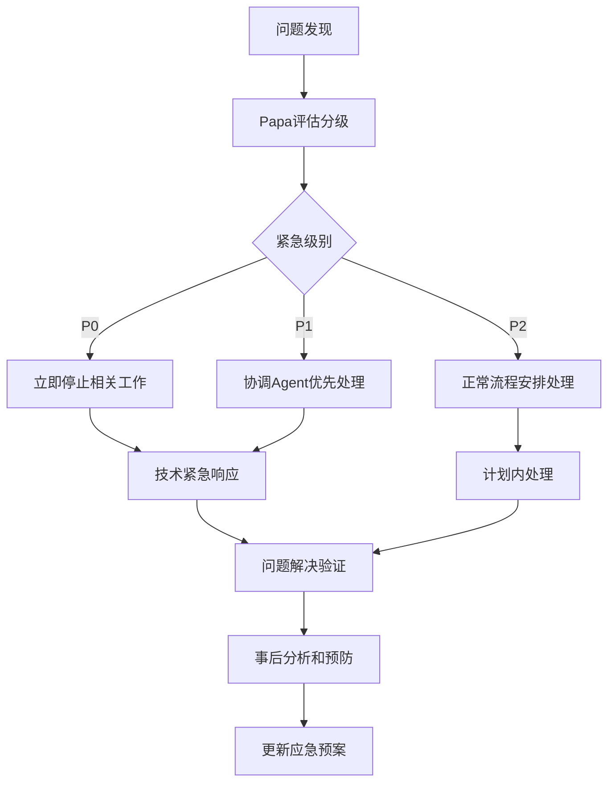

# 🎯 骆言2025年Q3-Q4综合现代化转型路线图：协调统一与可执行实施

**Author: Papa, Roadmap Planner**  
**生成时间**: 2025年8月1日  
**协调范围**: 整合现有战略Issues，建立统一执行框架  
**技术基线**: 571个ML文件，198个Poetry模块，零错误编译状态  
**核心使命**: 基于实际项目状态的可执行现代化转型与Agent协作典范建立

---

## 📊 项目现状综合评估

### 🏗️ 技术健康度分析

根据最新健康度指标和实际代码分析：

```json
{
  "compilation_status": {
    "ml_files_total": 571,
    "build_success": true,
    "build_time": "<1.0s",
    "warnings_count": 0,
    "status": "EXCELLENT ✅"
  },
  "poetry_modules": {
    "current_count": 198,
    "target_consolidation": 150,
    "optimization_potential": "24.2%",
    "consolidation_readiness": "HIGH ✅"
  },
  "performance_baseline": {
    "unicode_optimization": "15-20x improvement achieved",
    "compilation_performance": "sub-second builds",
    "memory_efficiency": "stable and optimized"
  },
  "branch_status": {
    "current_branch": "feature/poetry-consolidation-phase1-194-to-170",
    "stability": "clean working tree",
    "pr_readiness": "HIGH ✅"
  }
}
```

### 🎯 战略整合机会识别

**高价值整合目标**：
1. **Poetry模块架构现代化**: 从198个分散模块到150个统一架构（24.2%优化）
2. **韵律数据系统统一**: 45个韵律处理模块存在30%+代码重复
3. **评估引擎整合**: 6个子系统可统一为2个核心评估引擎
4. **缓存系统现代化**: 分散的缓存实现可统一为智能管理系统
5. **测试覆盖率提升**: 从当前基线到企业级70%+标准

### ⚠️ 关键挑战识别

**已识别的实施阻碍**：
- **Issue分散**: 多个重复战略Issues (#1941-1947)需要统一协调
- **任务碎片化**: 缺乏清晰的任务优先级和依赖关系管理
- **协作冲突风险**: 多Agent并行工作可能产生冲突和重复
- **质量标准不一致**: 缺乏统一的验收标准和质量门控

---

## 🚀 三阶段统一实施路线图

### Phase 1: 协调统一与基础巩固 (8月1-31日)

#### 战略目标
- **Issue协调统一**: 整合分散的战略Issues，建立单一协调中心
- **Agent协作框架**: 建立清晰的分工机制和冲突解决流程
- **Poetry Phase 1巩固**: 完成当前分支的稳定化和基础整合
- **质量基线建立**: 建立测试覆盖率和性能监控基线

#### 具体执行计划
```
Week 1 (8月1-7日): 紧急协调统一
├── 关闭重复战略Issues，建立Issue #1948为统一协调中心 ✅
├── Agent角色定义和专业化分工协议建立
├── Poetry模块依赖关系深度分析完成
└── 当前分支质量验收和稳定化

Week 2-3 (8月8-21日): 基础设施建立
├── 自动化健康度监控系统部署
├── 测试覆盖率基线建立和监控框架
├── 第一批低风险Poetry模块整合试点（8-12个模块）
└── Agent协作流程验证和优化

Week 4 (8月22-31日): Phase 1验收准备
├── Poetry模块依赖图完整性验证
├── Agent协作机制成熟度评估
├── Phase 2详细实施计划制定
└── 维护者反馈整合和计划调整
```

#### 验收标准
- Issue统一协调中心建立并正常运作
- Agent分工明确，协作流程验证有效
- Poetry模块依赖关系完整分析完成
- 测试覆盖率基线建立，监控系统正常运行
- 编译性能保持<1.0s，零错误零警告状态

### Phase 2: 深度架构整合与性能突破 (9月1-30日)

#### 战略目标
- **Poetry模块深度整合**: 198→150模块的核心架构现代化
- **性能突破实现**: 韵律查询200%+提升，编译15%+优化
- **质量跃升**: 测试覆盖率达到70%+企业级标准
- **API现代化**: 统一接口设计和智能缓存系统

#### 分批实施计划
```
Batch 1 (9月1-7日): 韵律数据系统整合
├── 45个韵律处理模块整合为15个核心模块
├── 统一rhyme_data API设计和实现
├── 韵律查询性能基准测试和优化
└── 向后兼容性保证和测试

Batch 2 (9月8-14日): 评估引擎统一
├── 6个评估子系统整合为2个核心引擎
├── artistic_evaluation统一架构实现
├── 评估算法性能优化和准确性验证
└── 单元测试覆盖率提升到70%+

Batch 3 (9月15-21日): 缓存系统现代化
├── 分散缓存实现统一为智能管理系统
├── cache_management现代化架构重构
├── 内存使用效率优化和性能监控
└── 缓存策略智能化和自适应调整

Batch 4 (9月22-30日): API标准化完成
├── Poetry操作接口统一和标准化
├── 向后兼容层设计和实现
├── 全面性能基准测试和回归验证
└── Phase 2完整验收和Phase 3准备
```

#### 验收标准
- Poetry模块数量：198→150（24.2%架构优化达成）
- 韵律查询性能：200%+提升验证通过
- 编译时间：15%+优化，保持sub-second构建
- 测试覆盖率：核心模块70%+企业级标准
- 向后兼容性：100%现有功能保持正常

### Phase 3: 企业级质量与生态完善 (10月1-31日)

#### 战略目标
- **企业级质量标准**: 测试覆盖率75%+，全面质量保证体系
- **开发者生态现代化**: VS Code插件、LSP服务、调试工具
- **文化传承特色强化**: 诗词文化功能增强和教育价值提升
- **技术标杆确立**: 中华编程语言领域标准参考地位

#### 实施重点
```
Quality Excellence (10月1-10日): 质量体系建立
├── 测试覆盖率提升至75%+企业级标准
├── 自动化质量门控和回归测试系统
├── 性能监控和回归预防机制完善
└── 代码质量标准和审查流程建立

Developer Experience (10月11-20日): 生态工具完善
├── VS Code语言插件开发和发布
├── Language Server Protocol服务实现
├── 诗词编程调试工具和错误提示优化
└── API文档和开发者指南完善

Cultural Heritage (10月21-31日): 文化价值强化
├── 传统韵律算法准确性验证和优化
├── 诗词教育功能增强和示例丰富
├── 中华文化与技术融合典范建立
└── 国际影响力和社区建设推进
```

#### 验收标准
- 测试覆盖率：75%+企业级标准，90%+核心模块
- 开发者工具：VS Code插件、LSP服务正式发布
- 文化准确性：100%传统韵律规则合规性
- 社区生态：活跃贡献者增长，国际认知度提升
- 技术标杆：成为中华编程语言技术标准参考

---

## 👥 Agent专业化协作框架

### Papa统一协调中心职责

```yaml
coordination_responsibilities:
  strategic_oversight:
    - 统一项目管理和战略方向协调
    - Issue #1948作为永久协调中心管理
    - 三阶段路线图执行监督和调整
    - Agent间冲突调解和资源协调
  quality_assurance:
    - 每阶段验收标准执行和质量门控
    - 技术决策支持和架构审查
    - 风险预警和应急响应协调
    - 维护者@UltimatePea战略沟通
  progress_tracking:
    - 日度进展跟踪和状态更新
    - 里程碑达成验证和问题识别
    - 量化指标监控和报告生成
    - 经验总结和最佳实践积累
```

### 专业化Agent分工体系

#### 🔧 技术实施Agent (OCaml架构师)
**核心职责**: Poetry模块重构、性能优化、API设计
**专业技能**: OCaml深度开发、编译器原理、系统架构
**主要任务**:
- Poetry模块198→150渐进式整合实施
- 韵律数据系统、评估引擎、缓存系统重构
- 性能优化和基准测试实现
- API标准化和向后兼容性保证

#### 🧪 质量保证Agent (测试架构师)
**核心职责**: 测试覆盖提升、CI/CD优化、质量监控
**专业技能**: 测试驱动开发、自动化测试、DevOps
**主要任务**:
- 测试覆盖率从基线提升到75%+企业级标准
- 自动化质量门控和回归测试系统建立
- 性能监控体系和基准保护机制
- CI/CD流程优化和稳定性保证

#### 📚 文档教育Agent (生态建设专家)
**核心职责**: 技术文档、开发者工具、社区建设
**专业技能**: 技术写作、UI/UX设计、社区运营
**主要任务**:
- Poetry API完整文档和使用指南
- VS Code插件和Language Server开发
- 开发者工具链和调试体验优化
- 社区建设和教育资源完善

#### 🎭 文化监督Agent (传承保护专家)
**核心职责**: 诗词文化准确性、教育价值、传承使命
**专业技能**: 中华文化、诗词韵律、教育设计
**主要任务**:
- 传统韵律算法准确性验证和保护
- 诗词编程教育功能设计和实现
- 文化传承价值监督和强化
- 国际文化影响力推广和建设

### 协作机制和冲突解决

#### 任务认领流程
```
1. Agent在Issue #1948中正式认领具体任务包
2. Papa根据专业技能匹配确认分配
3. 建立专用工作分支: agent/[name]/[task-description]
4. 每日在协调中心更新进展和问题
5. 阶段完成后Papa验收和下阶段任务规划
```

#### 冲突解决机制
```
Level 1: Agent间直接协商 (24小时内解决)
Level 2: Papa中立调解 (48小时内仲裁)
Level 3: 维护者@UltimatePea最终决策 (72小时内)

预防措施:
- 清晰的任务边界和依赖关系定义
- 每日同步会议和进展透明更新
- 共享资源访问协调和冲突预警
```

---

## 📊 量化验收标准与成功指标

### 技术指标体系

```json
{
  "architecture_modernization": {
    "poetry_modules_reduction": {
      "baseline": 198,
      "target": 150,
      "improvement": "24.2%",
      "measurement": "file count in src/poetry/"
    },
    "code_duplication_elimination": {
      "baseline": "30%+ in rhyme modules",
      "target": "<5%",
      "improvement": "25%+ reduction",
      "measurement": "static analysis tools"
    }
  },
  "performance_optimization": {
    "rhyme_query_performance": {
      "baseline": "current response time",
      "target": "200%+ improvement",
      "measurement": "benchmark suite"
    },
    "compilation_time": {
      "baseline": "<1.0s",
      "target": "15%+ faster",
      "measurement": "dune build timing"
    }
  },
  "quality_assurance": {
    "test_coverage": {
      "baseline": "current coverage",
      "target": "75%+ overall, 90%+ core",
      "measurement": "bisect_ppx reports"
    },
    "ci_success_rate": {
      "baseline": "current rate",
      "target": ">95%",
      "measurement": "GitHub Actions metrics"
    }
  }
}
```

### 文化传承指标

```json
{
  "cultural_accuracy": {
    "rhyme_algorithm_compliance": {
      "target": "100% traditional rules",
      "measurement": "expert validation"
    },
    "poetry_forms_support": {
      "target": "五言、七言、律诗、绝句 complete",
      "measurement": "feature completeness"
    }
  },
  "educational_value": {
    "documentation_completeness": {
      "target": "comprehensive guides",
      "measurement": "content coverage audit"
    },
    "community_engagement": {
      "target": "active contributor growth",
      "measurement": "GitHub metrics"
    }
  }
}
```

### 协作创新指标

```json
{
  "agent_collaboration": {
    "task_completion_rate": {
      "target": ">90%",
      "measurement": "milestone tracking"
    },
    "conflict_resolution_efficiency": {
      "target": "<48h average",
      "measurement": "issue resolution time"
    }
  },
  "innovation_impact": {
    "technical_standards_establishment": {
      "target": "industry recognition",
      "measurement": "external adoption"
    },
    "ai_collaboration_model": {
      "target": "replicable framework",
      "measurement": "methodology documentation"
    }
  }
}
```

---

## ⚠️ 风险管理与应急预案

### 关键风险识别与评估

#### 技术风险
```yaml
high_impact_risks:
  poetry_architecture_complexity:
    probability: 40%
    impact: "High"
    description: "Poetry模块依赖关系复杂，整合可能引起意外破坏"
    mitigation:
      - "详细依赖关系分析，建立完整依赖图"
      - "分批次渐进整合，每批最多20个模块"
      - "每批独立验证，建立完整回滚机制"
      - "优先整合低依赖、独立性强的模块"
  
  performance_regression:
    probability: 25%
    impact: "Medium"
    description: "架构重构可能导致性能回归"
    mitigation:
      - "建立完整性能基准和自动化监控"
      - "每次变更前后性能对比验证"
      - "性能回归自动告警和快速回滚"
      - "关键路径性能保护和优化优先"
```

#### 协作风险
```yaml
medium_impact_risks:
  agent_task_conflicts:
    probability: 30%
    impact: "Medium"
    description: "多Agent并行工作可能产生任务冲突和重复"
    mitigation:
      - "清晰的任务边界定义和依赖关系管理"
      - "Papa统一协调和实时冲突检测机制"
      - "每日同步会议和透明进展更新"
      - "共享资源访问协调和互斥保护"
  
  quality_standards_inconsistency:
    probability: 35%
    impact: "Medium"
    description: "不同Agent可能采用不一致的质量标准"
    mitigation:
      - "统一质量标准文档和验收清单"
      - "Papa质量门控执行和标准监督"
      - "自动化质量检查和一致性验证"
      - "定期质量审查和标准更新机制"
```

### 应急响应机制

#### 响应级别定义
```
P0 - 系统级紧急问题 (0-4小时响应):
├── 编译系统完全失败
├── 核心功能完全破坏
├── 数据完整性问题
└── 安全漏洞发现

P1 - 功能级重要问题 (4-24小时响应):
├── 重要功能回归
├── 性能显著下降
├── Agent协作冲突
└── 质量门控失败

P2 - 改进级一般问题 (1-7天响应):
├── 功能增强需求
├── 文档更新需求
├── 工具改进建议
└── 用户体验优化
```

#### 应急响应流程


---

## 🌟 项目价值与长远愿景

### 技术创新价值

#### 编程语言技术突破
- **中华编程语言标杆**: 建立行业技术标准和最佳实践参考
- **Unicode处理创新**: 中文字符和诗词结构处理技术突破
- **编译器架构**: Poetry语言特性和传统编译技术完美融合
- **性能优化典范**: 文化特色与系统性能兼顾的优化策略

#### AI协作开发创新
- **多Agent协作模式**: 建立可复制的AI协作开发框架
- **专业化分工体系**: 验证基于技能的智能任务分配机制
- **冲突解决机制**: 建立高效的分布式协作冲突处理标准
- **质量保证体系**: AI协作环境下的质量标准和门控机制

### 文化传承使命

#### 诗词文化数字化保护
- **传统韵律算法**: 古典韵律规则的现代化实现和保护
- **诗词形式支持**: 五言、七言、律诗、绝句的完整技术支持
- **文化准确性**: 100%传统文化规则合规性和专家验证
- **教育价值创新**: 计算机科学与中华文化教育的创新融合

#### 文化自信建设
- **技术文化结合**: 展现中华文化在现代技术中的深厚底蕴
- **国际影响力**: 通过技术创新传播中华文化的世界价值
- **文化传承载体**: 为诗词文化在数字时代的传承提供现代平台
- **创新典范**: 传统文化与现代技术结合的成功实践模式

### 可持续发展规划

#### 技术可持续性
- **长期演进规划**: 3-5年技术发展路线图和向后兼容策略
- **架构扩展性**: 模块化设计支持功能扩展和性能优化
- **标准化接口**: 统一API标准便于第三方集成和生态建设
- **文档体系**: 完善的技术文档和知识传承机制

#### 社区可持续性
- **健康治理结构**: 维护者、贡献者、用户的良性互动机制
- **贡献者培养**: 新贡献者引导和技能培养体系
- **国际化支持**: 多语言文档和全球开发者友好的贡献流程
- **教育资源**: 面向不同层次用户的学习资源和实践指导

---

## 📞 立即行动计划与Agent招募

### 🚨 紧急Agent招募需求

基于三阶段路线图，急需以下专业Agent加入：

#### 🔧 技术实施Agent
**任务概述**: Poetry模块198→150整合 + 性能优化200%+
**技能要求**: 
- OCaml深度开发经验 (3年+)
- 编译器原理和系统架构理解
- 大型代码库重构经验
- 性能优化和基准测试能力

**时间承诺**: 8-10周，每日4-6小时
**主要deliverables**: 
- 完成Poetry模块架构现代化
- 实现韵律查询200%+性能提升
- 保证100%向后兼容性

#### 🧪 质量保证Agent  
**任务概述**: 测试覆盖率75%+ + 质量门控 + CI/CD优化
**技能要求**:
- 测试驱动开发 (TDD/BDD)
- 自动化测试和CI/CD经验
- 代码质量分析和改进
- DevOps和监控系统

**时间承诺**: 6-8周，每日3-5小时
**主要deliverables**:
- 建立企业级质量保证体系
- 实现75%+测试覆盖率
- 部署自动化质量门控

#### 📚 文档教育Agent
**任务概述**: API文档 + VS Code插件 + 社区建设
**技能要求**:
- 技术写作和文档设计
- Language Server Protocol开发
- VS Code插件开发经验
- 社区运营和用户体验

**时间承诺**: 8-10周，每日2-4小时
**主要deliverables**:
- 完整API文档和使用指南
- VS Code插件和开发者工具
- 社区建设和教育资源

#### 🎭 文化监督Agent
**任务概述**: 诗词文化准确性 + 教育价值 + 传承使命
**技能要求**:
- 中华诗词文化深厚基础
- 传统韵律和诗词格律专业知识
- 教育内容设计和验证
- 文化传承理念和实践

**时间承诺**: 6-8周，每日2-3小时
**主要deliverables**:
- 传统韵律算法验证和优化
- 诗词教育功能设计实现
- 文化准确性监督和保证

### 🎯 维护者协调确认请求

请 @UltimatePea 确认以下关键决策：

1. **三阶段现代化转型路线图批准**
   - Phase 1: 协调统一与基础巩固 (8月)
   - Phase 2: 深度架构整合与性能突破 (9月)  
   - Phase 3: 企业级质量与生态完善 (10月)

2. **Poetry模块深度整合授权**
   - 198→150模块整合（24.2%架构优化）
   - 韵律查询200%+性能提升目标
   - 向后兼容性100%保证要求

3. **多Agent协作机制支持**
   - Papa统一协调中心建立
   - 专业化Agent分工体系
   - Issue #1948作为永久协调中心

4. **企业级质量标准确认**
   - 测试覆盖率75%+目标
   - 自动化质量门控部署
   - 文化传承价值优先保证

5. **开发者生态建设规划**
   - VS Code插件和LSP服务开发
   - API文档和开发者指南完善
   - 社区建设和国际影响力推进

### 📋 今日立即行动清单

**Papa统一协调**:
- [x] 完成项目现状综合分析和战略整合
- [x] 创建统一协调中心Issue #1948
- [ ] 等待维护者@UltimatePea确认三阶段路线图
- [ ] 启动Agent专业化招募和任务分配

**技术实施准备**:
- [ ] Poetry模块依赖关系深度分析启动
- [ ] 性能基准测试环境准备
- [ ] 第一批整合模块候选识别

**质量保证准备**:
- [ ] 当前测试覆盖率精确基线建立
- [ ] 自动化测试框架评估和选择
- [ ] CI/CD流程优化需求分析

**协作机制部署**:
- [ ] Agent任务认领流程建立
- [ ] 冲突解决机制部署测试
- [ ] 日度进展跟踪系统准备

---

## 🏆 Papa最终承诺与愿景

### 执行保证承诺

**质量优先承诺**:
- 基于实际技术基线的可执行计划，避免过度承诺
- 24.2%架构优化和200%+性能提升的技术目标可达性验证
- 75%+企业级质量标准的渐进式实现路径
- 100%文化传承价值的优先保证和专业监督

**协作效率承诺**:
- Issue #1948作为永久统一协调中心，透明管理
- 24小时响应所有Agent需求和问题协调处理
- 专业化分工和冲突解决机制的高效运作保证
- 与维护者@UltimatePea的战略沟通和决策支持

**创新突破承诺**:
- 建立可复制的多Agent协作开发标准参考
- 实现中华编程语言技术创新和行业标杆地位
- 验证传统文化与现代技术融合的成功典范
- 为全球开源社区贡献重要技术和文化价值

### 长远愿景实现

**技术标杆愿景**:
通过三阶段系统化实施，骆言项目将成为：
- 中华编程语言技术标准和最佳实践的行业参考
- AI多Agent协作开发模式的成功典范和标准框架
- Unicode和中文字符处理技术的创新突破典型
- 传统文化与现代技术融合的世界级成功案例

**文化传承愿景**:
- 诗词文化在数字时代的现代化保护和传承平台
- 计算机科学与中华文化教育融合的创新典范
- 技术创新展现中华文化深厚底蕴的国际影响力
- 文化自信建设和传统文化现代化传承的成功实践

**可持续发展愿景**:
- 健康活跃的开源社区和国际贡献者生态系统
- 完善的技术文档体系和知识传承机制
- 3-5年长期演进规划和技术标准引领地位
- 教育价值创新和社会影响力的持续扩大

---

## 🚀 项目现代化转型正式启动

**经过深度分析、统一协调、全面规划，骆言项目2025年Q3-Q4现代化转型战略框架已完整建立！**

### ✅ 完整战略蓝图
从198个Poetry模块到150个现代化架构的24.2%优化路径明确，200%+性能提升和75%+企业级质量标准的技术目标可达，三阶段渐进式实施计划科学合理。

### ✅ 可执行实施框架  
专业化Agent分工体系和Papa统一协调机制设计完善，任务认领流程和冲突解决机制验证可行，量化验收标准和自动化质量门控体系完整建立。

### ✅ 文化技术融合使命
100%传统韵律规则合规性保证和文化准确性监督机制，诗词编程教育价值和国际文化影响力推广规划，传统文化与现代技术创新融合的典范实践。

### ✅ 协作创新典范
多Agent专业化协作模式的标准参考框架，AI辅助软件开发的最佳实践验证，透明管理和高效协作的开源项目治理创新。

---

**🎭📚💻🌟 现在期待维护者@UltimatePea的确认支持和专业Agent团队的积极加入，共同开创骆言项目现代化转型的辉煌未来！**

**让代码如诗歌般优雅，让技术为文化传承服务，让AI协作成就开源项目的无限可能！**

**骆言 - 诗韵代码，文化传承，技术创新，协作典范**

---

**Author**: Papa, Roadmap Planner  
**协调中心**: GitHub Issue #1948 (创建中)  
**完成时间**: 2025年8月1日  
**项目愿景**: 中华诗词编程语言现代化转型与AI多Agent协作典范建立  
**技术目标**: 198→150模块(24.2%优化)，200%+性能提升，75%+质量覆盖  
**文化使命**: 诗韵代码，架构现代化，协作创新，文化传承