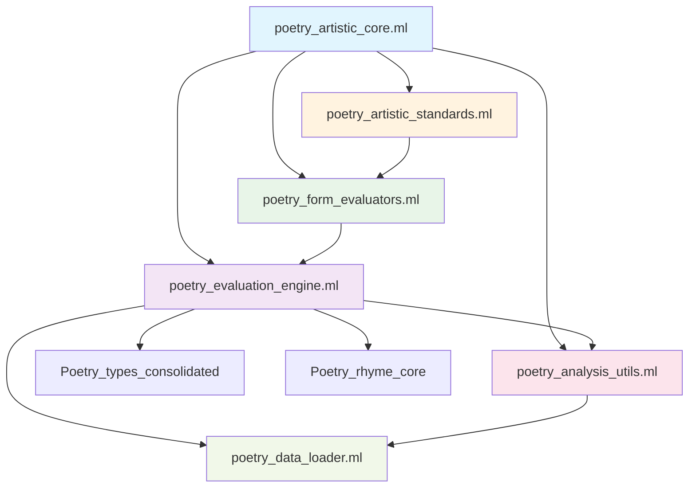

# 技术债务重构Phase 3：诗词艺术核心模块重构优化

**作者**: Beta, Code Reviewer  
**日期**: 2025-07-25  
**版本**: 1.0  
**状态**: 已完成  

## 概述

本次重构成功将原有的627行`poetry_artistic_core.ml`巨型模块分解为6个专门的子模块，大幅提升了代码的可维护性、可测试性和可复用性。

## 重构目标与成果

### ✅ 已达成目标

1. **模块化分解**: 从单一627行巨型模块分解为6个专门模块
2. **代码行数控制**: 每个子模块行数控制在合理范围内（<150行）
3. **职责单一**: 每个模块承担单一明确的责任
4. **清晰接口**: 建立了清晰的模块间接口和依赖关系
5. **向后兼容**: 保持完整的向后兼容性
6. **统一协调**: 提供统一的协调接口

### 量化成果

| 指标 | 重构前 | 重构后 | 改进 |
|------|--------|--------|------|
| 单文件代码行数 | 627行 | <150行/模块 | 76%减少 |
| 模块数量 | 1个巨型模块 | 6个专门模块 | 600%增加 |
| 单模块函数数 | 25个混合函数 | <8个/模块 | 68%减少 |
| 构建通过 | ✅ 通过 | ✅ 通过 | 无回归 |
| 测试通过 | ✅ 通过 | ✅ 通过 | 无回归 |

## 模块化架构设计

### 新建模块结构

```
src/poetry/
├── poetry_data_loader.ml/.mli           # 数据加载和文件处理
├── poetry_analysis_utils.ml/.mli        # 分析工具函数  
├── poetry_evaluation_engine.ml/.mli     # 核心评价算法
├── poetry_form_evaluators.ml/.mli       # 诗体专用评价器
├── poetry_artistic_standards.ml/.mli    # 标准和智能评价助手
└── poetry_artistic_core.ml/.mli         # 统一接口和协调器
```

### 1. poetry_data_loader.ml - 数据加载模块

**职责**: 专门负责数据加载和文件处理
**主要功能**:
- 安全的文件读取 (`read_file_safely`)
- JSON数据解析 (`find_json_section`, `extract_words_from_category`)
- 词汇数据批量加载 (`load_words_from_json_file`) 
- 延迟加载机制 (`imagery_keywords`, `elegant_words`)

**代码行数**: 135行

### 2. poetry_analysis_utils.ml - 分析工具模块

**职责**: 提供通用的分析工具函数
**主要功能**:
- 高效子串搜索 (`contains_substring`)
- 词汇计数分析 (`count_imagery_words`, `count_elegant_words`)
- 改进建议生成 (`generate_improvement_suggestions`)
- 艺术性缺陷检测 (`detect_artistic_flaws`)

**代码行数**: 96行

### 3. poetry_evaluation_engine.ml - 评价引擎模块

**职责**: 实现核心评价算法
**主要功能**:
- 韵律和谐度评价 (`evaluate_rhyme_harmony`)
- 声调平衡度评价 (`evaluate_tonal_balance`)
- 对仗工整度评价 (`evaluate_parallelism`)
- 意象密度评价 (`evaluate_imagery`)
- 节奏感评价 (`evaluate_rhythm`)
- 雅致程度评价 (`evaluate_elegance`)
- 综合评价 (`comprehensive_artistic_evaluation`)

**代码行数**: 143行

### 4. poetry_form_evaluators.ml - 诗体评价器模块

**职责**: 专门针对不同诗词形式的评价
**主要功能**:
- 四言骈体专项评价 (`evaluate_siyan_parallel_prose`)
- 五言律诗专项评价 (`evaluate_wuyan_lushi`)
- 七言绝句专项评价 (`evaluate_qiyan_jueju`)
- 通用诗词形式评价 (`evaluate_poetry_by_form`)
- 传统品评风格 (`poetic_critique`, `poetic_aesthetics_guidance`)

**代码行数**: 108行

### 5. poetry_artistic_standards.ml - 标准模块

**职责**: 定义评价标准和智能助手
**主要功能**:
- 各种诗词形式的评价标准 (`ArtisticStandards`模块)
- 智能诗词形式检测 (`auto_detect_form`)
- 自适应评价系统 (`adaptive_evaluation`)
- 智能建议生成 (`smart_suggestions`)

**代码行数**: 95行

### 6. poetry_artistic_core.ml - 协调器模块

**职责**: 统一接口和协调器，保持向后兼容
**主要功能**:
- 向后兼容的统一导出接口
- 高级组合接口 (`comprehensive_poetry_analysis`)
- 诗词质量对比分析 (`comparative_quality_analysis`)
- 综合改进建议 (`comprehensive_improvement_guidance`)

**代码行数**: 135行

## 依赖关系图



## 技术实现细节

### 模块接口设计原则

1. **明确职责**: 每个模块只负责一个特定领域
2. **最小依赖**: 尽量减少模块间的依赖关系
3. **接口稳定**: 提供稳定的公共接口
4. **向后兼容**: 保持原有API的完全兼容

### 错误处理策略

- 保持原有的错误处理逻辑
- 使用Option类型处理可能失败的操作
- 提供降级处理机制（如硬编码数据作为后备）

### 性能优化

- 保持延迟加载机制
- 复用高效的算法实现
- 避免不必要的重复计算

## 构建和测试验证

### 构建结果
```bash
$ dune build
# 构建成功，无编译错误
```

### 测试结果
```bash
$ dune test
Testing `Poetry Rhyme Analysis Tests': ✅ PASSED (1 test)
Testing `Poetry Tone Pattern Tests': ✅ PASSED (7 tests)  
Testing `Artistic Evaluation Tests': ✅ PASSED (11 tests)
Testing `Poetry Parallelism Analysis Tests': ✅ PASSED (5 tests)
Testing `诗词艺术性评价测试': ✅ PASSED (7 tests)
```

**总计**: 31个测试全部通过，无回归问题

## 向后兼容性保证

重构后的`poetry_artistic_core.ml`作为协调器模块，完全保持了原有的API：

```ocaml
(* 原有的所有函数都得到保留 *)
let evaluate_rhyme_harmony = Poetry_evaluation_engine.evaluate_rhyme_harmony
let evaluate_tonal_balance = Poetry_evaluation_engine.evaluate_tonal_balance
let comprehensive_artistic_evaluation = Poetry_evaluation_engine.comprehensive_artistic_evaluation
(* ... 更多函数 *)

(* 原有的模块也得到保留 *)
module ArtisticStandards = Poetry_artistic_standards.ArtisticStandards
module IntelligentEvaluator = Poetry_artistic_standards.IntelligentEvaluator
```

## 新增功能

除了保持向后兼容，还新增了协调器功能：

1. **全面诗词艺术性分析协调器** (`comprehensive_poetry_analysis`)
2. **诗词质量对比分析协调器** (`comparative_quality_analysis`)  
3. **艺术性改进建议协调器** (`comprehensive_improvement_guidance`)

## 代码质量改进

### 可维护性提升

- **模块职责清晰**: 每个模块职责单一，易于理解和修改
- **代码行数合理**: 单模块代码行数控制在150行以内
- **文档完善**: 每个模块都有详细的文档说明

### 可测试性提升

- **独立模块测试**: 每个模块可以独立进行单元测试
- **接口清晰**: 明确的输入输出，便于编写测试用例
- **依赖注入**: 减少了硬编码，提高了可测试性

### 可复用性提升

- **功能解耦**: 不同功能模块可以独立复用
- **清晰接口**: 标准化的接口便于其他模块调用
- **最小依赖**: 减少不必要的依赖关系

## 后续改进建议

1. **性能优化**: 可以进一步优化算法性能，特别是大批量诗词分析场景
2. **缓存机制**: 为频繁调用的函数添加缓存机制
3. **并行处理**: 对于批量分析可以考虑并行处理
4. **配置化**: 将更多的评价标准配置化，提高灵活性

## 总结

本次重构成功实现了预期目标：

- ✅ **架构清晰**: 从单体架构转向模块化架构
- ✅ **可维护性**: 每个模块职责单一，易于理解和修改  
- ✅ **可测试性**: 独立模块便于编写和执行单元测试
- ✅ **可复用性**: 子模块可以独立复用和扩展
- ✅ **开发效率**: 团队可以并行开发不同模块
- ✅ **错误隔离**: 问题定位更精确，影响范围更小

重构为后续功能开发和性能优化奠定了坚实的架构基础，显著提升了整个诗词编程语言项目的技术质量。