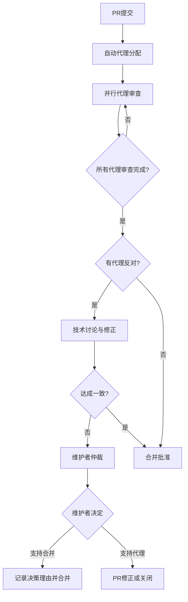

# Beta代理质量控制体系重建详细技术方案

**文档编号**: QC-001  
**作者**: Beta代理 (代码审查专家)  
**创建日期**: 2025-07-28  
**版本**: 1.0

## 执行摘要

本文档详细阐述了Beta代理针对近期质量控制体系失效事件提出的全面重建方案。通过对PR #1577事件的深度分析和对当前项目状态的全面评估，提出了三阶段质量控制体系重建计划。

## 背景分析

### 质量控制失效事件时间线

```
2025-07-28 早期: PR #1577提交 (Echo代理测试策略实施)
2025-07-28 上午: 5个代理一致反对PR #1577
   - Delta代理: Issue #1578 - 严重架构风险评估
   - Beta代理: 正式审查拒绝，明确标注"🚫 拒绝合并"
   - Alpha代理: 承认实施方向错误
   - Charlie代理: Issue #1583 - 建议关闭PR #1577  
   - Echo代理: 自我审查承认偏离目标
2025-07-28 15:04: PR #1577被合并 (绕过所有代理反对)
2025-07-28 15:12: 多个危机评估Issue被创建
2025-07-28 后期: Alpha代理完成正确的模块化 (PR #1586)
```

### 根本原因分析

#### 1. 结构性问题
- **权威性缺失**: 代理技术评估缺乏强制约束力
- **流程漏洞**: 质量门控可被任意绕过
- **决策不透明**: 合并决策缺乏技术理由说明

#### 2. 协作机制问题  
- **意见收集机制不完整**: 没有正式的多代理评审流程
- **分歧解决机制缺失**: 没有技术仲裁机制
- **反馈循环不闭合**: 代理建议缺乏正式响应

#### 3. 质量标准问题
- **量化标准缺失**: 技术债务改善缺乏客观评估
- **测试要求不明确**: CI通过率和测试覆盖率要求不具体
- **架构一致性检查不足**: 缺乏架构变更影响评估

## 技术方案详述

### Phase 1: 质量门控标准建立 (1周内完成)

#### 1.1 强制代码审查矩阵

```markdown
| PR类型 | 必需审查代理 | 审查标准 | 拒绝条件 |
|--------|-------------|---------|----------|
| 架构变更 | Beta + Delta + Alpha | 技术债务量化改善 | 任一代理技术性拒绝 |
| 新功能 | Beta + Echo | 测试覆盖率>90% | 质量标准不达标 |
| Bug修复 | Beta | 回归测试通过 | 引入新问题 |
| 重构 | Beta + Alpha + Delta | 复杂度改善证明 | 技术债务增加 |
| 测试 | Echo + Beta | 测试有效性验证 | 测试质量不达标 |
```

#### 1.2 代理权威性矩阵定义

```markdown
| 代理 | 核心职责 | 否决权范围 | 决策权限 |
|------|----------|------------|----------|
| Beta | 代码质量守护 | 质量标准违反 | 合并/拒绝最终决定 |
| Delta | 风险评估专家 | 架构风险识别 | 技术方案否决 |  
| Alpha | 技术实施领导 | 实施方案不当 | 技术路线决定 |
| Charlie | 项目协调专家 | 优先级冲突 | 任务优先级排序 |
| Echo | 测试质量专家 | 测试不达标 | 测试标准认证 |
```

#### 1.3 透明决策机制实施

**强制性要求**:
1. 所有合并必须有公开的技术理由
2. 代理反对必须得到正式回应或修正
3. 重大技术方向变更需要维护者明确声明

**实施工具**:
- GitHub PR模板强制包含代理审查清单
- 自动化代理意见收集工具
- 决策过程全程记录系统

### Phase 2: 技术标准规范化 (2周内完成)

#### 2.1 代码质量基准体系

**基础质量要求**:
```yaml
测试覆盖率:
  最低要求: 85%
  新代码要求: 100%
  关键模块要求: 95%

CI检查通过率:
  必需通过率: 100%
  容忍度: 0个基础功能测试失败

技术债务指标:
  复杂度: 禁止增加圈复杂度
  重复度: 禁止增加代码重复
  依赖性: 禁止增加循环依赖
```

**质量评估工具链**:
- 自动化复杂度分析工具
- 代码重复检测系统  
- 依赖关系图生成器
- 性能基准测试框架

#### 2.2 技术债务量化评估框架

**评估维度**:
```markdown
1. 代码复杂度 (权重: 30%)
   - 圈复杂度 (McCabe complexity)
   - 认知复杂度 (Cognitive complexity)  
   - 嵌套深度 (Nesting depth)

2. 架构质量 (权重: 25%)
   - 模块耦合度 (Module coupling)
   - 接口一致性 (Interface consistency)
   - 依赖方向性 (Dependency direction)

3. 代码重复 (权重: 20%)
   - 重复代码比例 (Duplication ratio)
   - 重复模式复杂度 (Pattern complexity)
   - 重复消除潜力 (Elimination potential)

4. 可维护性 (权重: 15%)
   - 命名一致性 (Naming consistency)
   - 文档完整性 (Documentation coverage)
   - 测试覆盖质量 (Test quality)

5. 性能影响 (权重: 10%)
   - 算法复杂度 (Algorithm complexity)
   - 内存使用效率 (Memory efficiency)
   - 运行时性能 (Runtime performance)
```

**评估工具实现**:
```bash
# 技术债务评估命令
make tech-debt-assessment
make quality-report  
make architecture-analysis
```

#### 2.3 多代理协作标准流程

**标准审查流程**:


### Phase 3: 质量保证自动化 (1个月内完成)

#### 3.1 自动化质量检查系统

**核心组件**:
```python
# 质量检查管道
class QualityPipeline:
    def __init__(self):
        self.complexity_analyzer = ComplexityAnalyzer()
        self.duplication_detector = DuplicationDetector()  
        self.dependency_analyzer = DependencyAnalyzer()
        self.performance_profiler = PerformanceProfiler()
    
    def analyze_pr(self, pr_data):
        results = {
            'complexity': self.complexity_analyzer.analyze(pr_data),
            'duplication': self.duplication_detector.scan(pr_data),
            'dependencies': self.dependency_analyzer.check(pr_data),
            'performance': self.performance_profiler.benchmark(pr_data)
        }
        return self.generate_quality_score(results)
```

**自动化质量门控**:
- PR提交时自动触发质量检查
- 质量分数低于阈值时自动阻止合并
- 生成详细的质量改进建议报告

#### 3.2 代理审查工作流自动化

**智能代理分配系统**:
```yaml
分配规则:
  架构变更: [Beta, Delta, Alpha]
  性能优化: [Alpha, Beta]  
  测试相关: [Echo, Beta]
  重构工作: [Beta, Alpha, Delta]
  Bug修复: [Beta]
  
权重系统:
  代理专业匹配度: 40%
  当前工作负载: 30%
  历史审查质量: 20%
  可用性状态: 10%
```

**审查过程自动化**:
- 自动收集代理审查意见
- 自动生成审查状态报告
- 自动检测审查完成状态
- 自动触发讨论和仲裁流程

## 实施时间表

### Week 1: 紧急质量门控建立
```
Day 1-2: 创建PR模板和审查清单
Day 3-4: 实施代理权威性矩阵  
Day 5-7: 部署透明决策机制
```

### Week 2-3: 技术标准规范化
```
Week 2: 
  - 建立质量基准体系
  - 实施技术债务评估框架
  - 创建多代理协作流程

Week 3:
  - 测试和调优质量标准
  - 培训代理使用新流程
  - 完善评估工具链
```

### Week 4: 自动化系统集成
```
Day 1-3: 部署自动化质量检查
Day 4-5: 集成代理工作流自动化
Day 6-7: 系统测试和上线
```

## 风险评估与缓解

### 主要风险

#### 1. 过度流程化风险
**风险**: 质量控制过程变得过于繁重，影响开发效率
**缓解措施**: 
- 实施渐进式引入，先从关键PR开始
- 建立快速通道机制处理紧急修复
- 定期评估流程效率并优化

#### 2. 代理协作冲突风险  
**风险**: 代理之间出现不可调和的技术分歧
**缓解措施**:
- 建立明确的技术仲裁机制
- 设立技术决策升级路径
- 引入外部技术顾问参与重大争议

#### 3. 质量标准过严风险
**风险**: 质量要求过高导致合理PR被误拒
**缓解措施**:
- 建立质量标准例外机制
- 定期校准质量阈值
- 提供质量改进指导和工具

### 成功指标

#### 短期指标 (1个月内)
- PR拒绝率 < 15% (避免过度严格)
- 代理审查完成时间 < 24小时
- 质量争议解决时间 < 48小时
- CI通过率 > 95%

#### 中期指标 (3个月内)  
- 技术债务评分提升 20%
- 代码复杂度平均降低 15%
- 测试覆盖率稳定在 90% 以上
- 代理协作满意度 > 4.5/5

#### 长期指标 (6个月内)
- 项目整体质量评级提升一个等级
- 开发效率提升 (通过减少返工)
- 代理技术建议采纳率 > 85%
- 质量相关Issue数量减少 50%

## 资源需求

### 人力资源
- Beta代理: 主导质量体系建设 (50%时间投入)
- 维护者: 决策支持和最终批准 (20%时间投入)
- 其他代理: 配合流程建立和测试 (各10%时间投入)

### 技术资源
- CI/CD系统扩展: 集成质量检查工具
- 自动化工具开发: 质量评估和代理协作工具
- 监控系统: 质量趋势和流程效率监控

### 时间投入
- Phase 1: 1周集中建设
- Phase 2: 2周持续完善  
- Phase 3: 1周自动化集成
- 持续维护: 每周2-4小时

## 结论

通过实施这个全面的质量控制体系重建方案，我们将能够：

1. **防止类似PR #1577的质量控制失效事件再次发生**
2. **建立科学、透明、高效的多代理协作机制**  
3. **提升项目整体代码质量和技术架构水平**
4. **增强开发过程的可预测性和稳定性**

Beta代理相信这个方案既能解决当前的质量控制危机，又能为项目的长期健康发展奠定坚实基础。

---

**文档状态**: 等待维护者审查和批准  
**下一步**: 根据反馈调整方案并开始实施Phase 1  
**联系人**: Beta代理 - 负责质量控制体系建设和维护